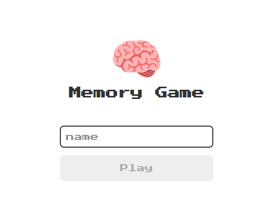
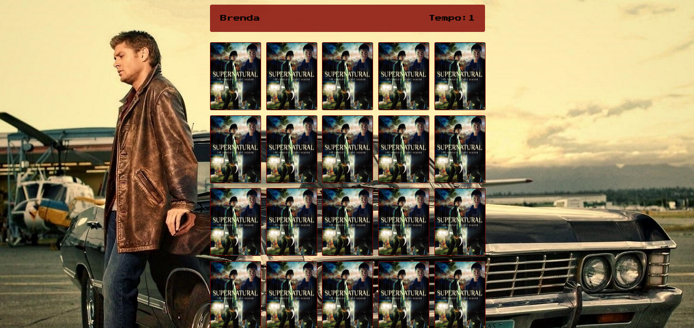
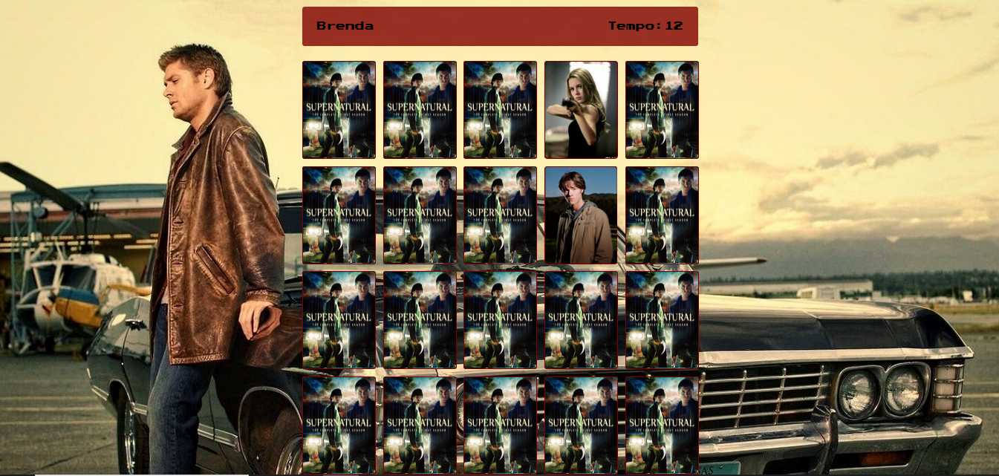
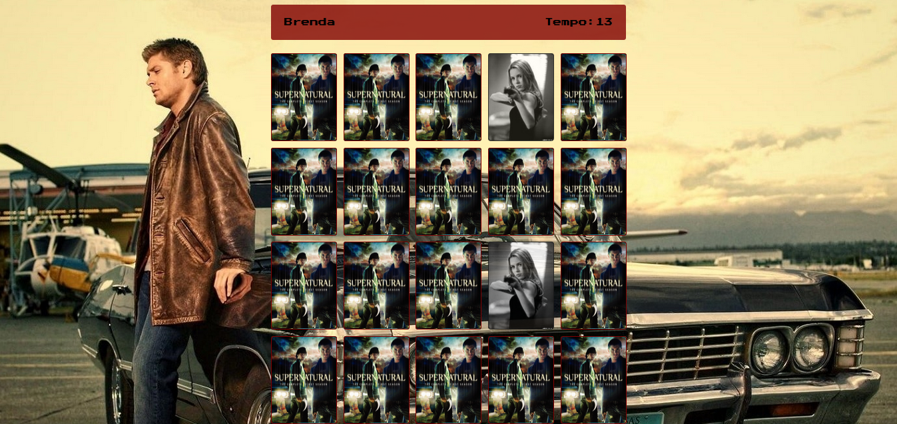
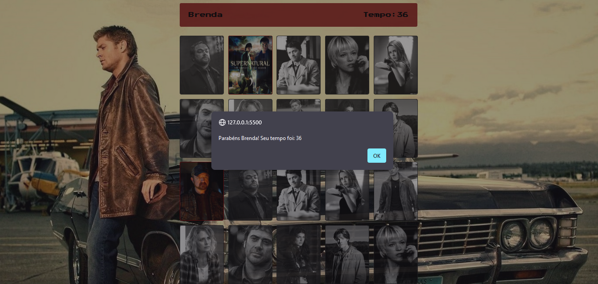

# Jogo da Memória 

Jogo da memória para ajudar no processo de aprendizagem de JavaScript. Nesse projeto foram utilizados HTML, CSS, SASS e JS.   
Todo conteúdo foi baseado no canal [Manual do Deve](https://www.youtube.com/@ManualdoDev), que disponibilizou o conteúdo no YouTube em três partes sendo a [parte 1](https://www.youtube.com/playlist?list=PLdtmpu_1ITQJJoH-5D0sU2Q2N0wwgPGCi) de login, [parte 2](https://www.youtube.com/watch?v=tcbMmm77WOU&list=PLdtmpu_1ITQJJoH-5D0sU2Q2N0wwgPGCi&index=2&pp=iAQB) as regras do jogo e a [parte 3](https://www.youtube.com/watch?v=QbqKRxUyigw&list=PLdtmpu_1ITQJJoH-5D0sU2Q2N0wwgPGCi&index=4) a questão do nome do player e o timer.  
O bom dessa estrutura é que para mudar a temática, basta trocar as imagens da pasta img e o nome das imagens no Array do arquivo game.js. O projeto ainda está em processo, muitas coisas podem ser elaboradas para melhorar.

## RESULTADO
### Página de login
O botão "play" só ficará disponível quando o usuário digitar no mínimo 3 (três) caracteres.  

  

### Página do jogo

### Duas cartas erradas
Sempre que o usuário errar a combinação das cartas, elas voltam para a posição original.  

  

### Duas cartas iguais
Quando o usuário acertar a combinação das cartas, elas ficaram viradas e em preto e branco.  

### Ao acertar todas
Ao finalizar o jogo aparecerá uma mensagem parabenizando o jogador e o tempo que levou para finalizar.
